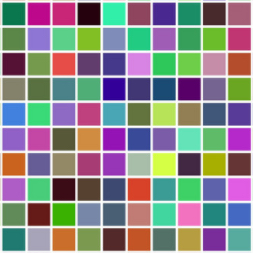

# js-test

### On load:

Using plain vanilla javascript to create square div containerSize \* containerSize

1. Create inside it numberOfChildren square elements which:
   - do no overlap each other
   - are fully contained within the container div
   - do not stretch container and not showing the scroll
   - has size childSize \* childSize (squares)
   - has random background color
2. In case container cannot fit numberOfChildren:
   - render as much children as container can fit and show message for the user about actual rendered number of children inside container.
3. When hover, child squares should change background colors randomly
4. When hover it longer than 2 seconds child square disappears

### Options to test if it appears correctly

- drawContainer(310, 200, 4);
- drawContainer(413, 42, 30);
- drawContainer(200, 300, 2);

### Expected result must be similar to this

- Create container
- Add elements
- Add height
- Add width
- Add random background color
- Place elements (flex and flex-wrap)
- Add listerner for hover
- Add timeout for 2 seconds
- Remove listener when mouseout
- Remove child when 2 seconds pass
- Add more childrens if there are available
- Error handling